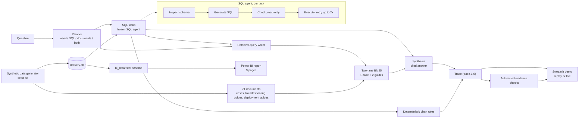

# AI Delivery Intelligence Agent

A portfolio project: an agent that answers questions about enterprise project delivery by combining **SQL analytics** over incident data with **retrieval over case and troubleshooting documents**, and shows its evidence. It comes with frozen benchmarks, a replayable Streamlit demo and a Power BI operations report.

> **Scope and honesty.** All data are synthetic, generated for this project, with intentionally planted operational patterns. Nothing here is real customer data, and the project was not deployed anywhere. Results come from small, frozen benchmarks (5 to 40 items, one run, one model) and are reported with their limits; they demonstrate method and engineering discipline, not production accuracy.

<!-- SCREENSHOT 1: demo/ page "Analysis" tab for A1 (line chart) -->
<!-- SCREENSHOT 2: demo/ page "Evaluation notes" for H2 (checks pass, answer wrong) -->
<!-- SCREENSHOT 3: Power BI page 1 -->

## What it does
Ask a question such as *"Which project currently has the most open incidents, and have we seen similar cases before?"*. A planner decides whether it needs SQL, document retrieval or both; the SQL agent queries the database; retrieval brings the most relevant historical cases and troubleshooting guides; a synthesis step writes an answer where every claim carries a citation (`[sql:t1]` for a query result, `[doc_id]` for a document). A deterministic layer then draws a chart from the recorded rows and runs automated evidence checks.

## Architecture

Design choices that matter:
- **Evidence over eloquence.** Each answer sentence is traceable to a SQL result or a document; the page shows both next to the answer.
- **The display layer adds no meaning.** Charts are chosen by deterministic rules from the recorded rows and verified against them (a fidelity check); no model chooses or edits a chart.
- **Automated evidence checks verify evidence consistency, not semantic correctness.** The sealed H2 answer passes every check and is still wrong (a SQL semantic error); the demo shows that case on purpose.
- **Frozen before measured.** Benchmarks, pipeline specification, corpus and data export are fingerprinted (SHA-256) before any model run; scripts rebuild them and compare.

## Try it
```powershell
pip install -r requirements.txt
python -m demo.preflight                 # what is installed, hashes, traces
streamlit run demo/streamlit_app.py      # Replay mode needs no API key
```
Replay mode shows nine recorded runs (four analytics questions recorded live with the frozen pipeline, five sealed benchmark runs with their human evaluation notes). Live mode runs the frozen pipeline with the visitor's own Gemini key (kept only in the session; 5 runs per session). No key is ever written to a file, the environment or a trace.

## Results (frozen contracts; every number with its n)
| Part | Result | Notes |
|---|---|---|
| SQL agent, benchmark v1.0 / v1.1 | v1.0: executed 5/5, strict 3/5, loose 4/5. v1.1: strict 5/5 in each of 3 complete runs, every query succeeded on the first attempt | Error analysis of v1.0 found two benchmark/evaluator defects (S5 scale; S4 top-1 vs full ranking and an ambiguous denominator). The specification was fixed as v1.1 and the **unchanged** agent re-evaluated, so the change is a benchmark fix, **not an agent improvement**. The three v1.1 runs are a repeatability smoke check on 5 questions, not a stability or accuracy claim. |
| Retrieval, BM25, rag-retrieval-2.0 | Hit@1 0.55, Hit@3 1.00, MRR 0.775, Strong-Hit@1 0.375 | 40 queries but only 20 distinct symptom texts (templates in the synthetic data); cluster bootstrap for uncertainty. Most Hit@1 misses are guides ranked above case documents. |
| Answer generation, generation-1.0 | 15/15 answers; 93 citation marks, 0 invalid; fact coverage 21/29 (72.4%); human-counted unsupported claims 3 in 15 | Coverage is completeness against the benchmark checklist; 7 of 8 misses were details the question did not explicitly ask for. |
| Hybrid pipeline, hybrid-1.0 | 5/5 answered; SQL facts human-confirmed 16/20; document facts covered 4/6; synthesis requirements 4/4; 0 invalid citations; 0 unsupported claims | Failure analysis: H2 SQL semantic error (pairs vs distinct incidents), H4 planner dropped a quarter (and a benchmark specification defect), H5 query-formulation failure. Route compliance 5/5 has no controls and is weak evidence. |

Read these together with the limits: one run, one model (`gemini-3.5-flash-lite`), provider default sampling, 5 questions in the hybrid benchmark, scores proposed by an external reviewer and adopted by the author. Details, defects and post-hoc diagnostics: `benchmark_history/CHANGELOG.md`, `benchmark_history/hybrid_v1_results_summary.md`, `benchmark_history/generation_v1_results_summary.md`.

## Power BI report
The same synthetic data is exported to a star schema (`bi_data/`, one fact table with one row per incident, four dimensions) and reported in Power BI on three pages: operations overview, resolution time and root causes, deployments and customers. Seven simple measures; every headline number can be reconciled with the agent's SQL results (`python -m analytics.powerbi_checks`). Build notes: `docs/POWERBI_SPEC.md`.

<!-- SCREENSHOTS 4-6: Power BI pages 2 and 3 -->

## Repository layout
| Path | Content |
|---|---|
| `generate_data.py`, `data/` | synthetic data generator (seed 58) and the SQLite database |
| `docs/` | the 71 synthetic documents (`historical_cases/`, `troubleshooting_guides/`, `deployment_guides/`) that retrieval searches, plus `POWERBI_SPEC.md` |
| `sql_agent/` | SQL agent (schema inspection, generation, read-only execution, retries), evaluation |
| `rag/` | corpus, BM25 and dense retrievers, benchmarks, hybrid pipeline and scorers |
| `benchmarks/`, `benchmark_history/` | frozen benchmark files and hashes; results, errata, changelog (see `benchmark_history/README.md`) |
| `ground_truth/` | evaluation-only reference data (see below) |
| `viz/` | deterministic chart-selection rules and fidelity check |
| `demo/`, `traces/` | Streamlit demo, trace schema, recorded runs |
| `analytics/`, `bi_data/` | BI export and tests, star-schema CSVs |
| `eval_results/` | intermediate retrieval runs kept for traceability |
| `release/` | productization manifest: hashes of the final demo version (release evidence; it does not re-freeze any benchmark) |

### Runtime boundaries
| Consumer | Reads | Never reads |
|---|---|---|
| Runtime agent | `data/`, `docs/` (retrieval corpus only), the frozen pipeline and specs in `benchmarks/` | `ground_truth/`, benchmark gold and rubrics |
| Demo (replay) | `traces/` | `ground_truth/`, benchmark gold and rubrics |
| BI | `bi_data/` | `ground_truth/`, model output |
| Evaluation only | `ground_truth/`, benchmark gold, rubrics, `benchmark_history/` | (not part of the runtime) |

`ground_truth/` is used by the data generator, the benchmark builders, the evaluators and the tests (for example, to detect leakage). It is never read by the runtime agent, the BI export or the demo.

**Retrieval corpus.** Only markdown files under `historical_cases/`, `troubleshooting_guides/`, and `deployment_guides/` are part of the retrieval corpus (71 documents, SHA-256 in `benchmarks/corpus.sha256`). `docs/POWERBI_SPEC.md` is build documentation, not part of the corpus. Presentation assets (Power BI files, screenshots, architecture images) live outside every directory the loaders, benchmarks and trace validation scan, so adding them cannot change a hash.

`benchmark_history/` is never renamed or reorganised: sealed traces and tests reference its paths. Its `README.md` marks which files are final, which are proposed or intermediate, and which analyses are post-hoc diagnostics only.

## Reproduce and verify
```powershell
python -m demo.test_demo; python -m demo.test_view; python -m demo.test_preflight
python -m analytics.export_bi --check          # bi_data equals a fresh export
python -m rag.build_hybrid_pipeline_spec --check
python -m demo.retrust --check                 # stored trust checks are current
```
The test suites cover the SQL agent, retrieval, generation scoring, the hybrid pipeline and scorer, the BI export, the chart rules and the demo (122 tests, plus 5 pre-flight tests).

## Limitations
- Synthetic data with planted patterns: the agent is shown to find what was planted, which demonstrates behaviour, not real-world accuracy.
- Small benchmarks and single runs; the hybrid benchmark has 5 questions, one of which (H5) is a deliberately chosen diagnostic slice.
- The answer step receives at most the first 30 rows of a SQL result; longer results are summarised from that prefix (visible in recorded run A1, whose chart still uses all rows).
- Retrieval is lexical (BM25); a query that contains an entity name (a project) can retrieve a same-project but non-similar case (H5, INC_0185).
- Automated evidence checks cannot detect a wrong SQL interpretation.

## Roadmap
Controls for routing (SQL-only, RAG-only, direct answer); hybrid lexical + dense retrieval; passing earlier SQL results into dependent tasks; and, as a separate V2, a knowledge-graph layer over projects, components and root causes.

## Author
Yanran Zhang (SophiaZ), MSc Geospatial Data Science, HKU.
